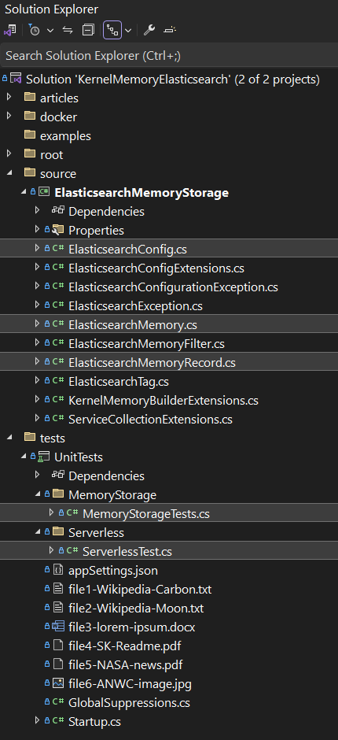

⚠️ The Elasticsearch connector for Kernel Memory has been incorporated in Microsoft Kernel Memory and this this repository 
has been archived.
You can find the latest source code [here](https://github.com/microsoft/kernel-memory/tree/main/extensions/Elasticsearch/Elasticsearch).

# Kernel Memory with Elasticsearch


Use [Elasticsearch](https://www.elastic.co/) as vector storage for Microsoft [Kernel Memory](https://github.com/microsoft/semantic-memory).

<div align="center">

</div>

<div align="center">

[](https://www.nuget.org/packages/Freemindlabs.KernelMemory.Elasticsearch) [](https://www.nuget.org/packages/Freemindlabs.KernelMemory.Elasticsearch) [](https://github.com/freemindlabsinc/FreeMindLabs.SemanticKernel/blob/main/LICENSE) 

</div>

---
**Kernel Memory** (KM) is a **multi-modal [AI Service](https://github.com/microsoft/kernel-memory/blob/main/service/Service/README.md)** specialized in the efficient indexing of datasets through custom continuous data hybrid pipelines, with support for **[Retrieval Augmented Generation](https://en.wikipedia.org/wiki/Prompt_engineering#Retrieval-augmented_generation)** (RAG), synthetic memory, prompt engineering, and custom semantic memory processing.


Utilizing advanced embeddings and LLMs, the system enables Natural Language querying for obtaining answers from the indexed data, complete with citations and links to the original sources.


---

This repository contains the **Elasticsearch adapter** that allows KM to use Elasticsearch as vector database, thus allowing developers to perform [lexical and semantic search](https://www.elastic.co/search-labs/blog/articles/lexical-and-semantic-search-with-elasticsearch), in addition to [hybrid](https://opster.com/guides/elasticsearch/machine-learning/elasticsearch-hybrid-search/), keyword and full-text search on your *semantic content*.

## Pre-requisites

1. A running instance of Elasticsearch

    1. You can install a **local instance** of Elasticsearch using Docker.
    To simplify the setup of a running instance of Elasticsearch we prepared the article [Installing the Elastic Stack using Docker Compose](/docker/README.md) that guides you through the process. *The following diagram shows what will be running once the installation is complete.*
<div align="center">
    
</div>

2. Alternatively you can use a **cloud** service like [Elastic Cloud](https://www.elastic.co/cloud/). The free tier is enough.

## Configuration

The xUnit project UnitTests contains an [appSettings.json](tests/UnitTests/appSettings.json) file that lists all available options. The file reads as follows:

```
{
  "OpenAI": {
    "ApiKey": "...SECRETS...",
    "EmbeddingModelId": "text-embedding-ada-002",
    "ModelId": "text-davinci-003",
    "ChatModelId": "gpt-3.5-turbo"
  },  
  "Elasticsearch": {
    "CertificateFingerPrint": "...SECRETS...",
    "Endpoint": "https://localhost:9200",
    "UserName": "...SECRETS...",
    "Password": "...SECRETS..."
  }
}
```

>*The class used to store configuration is [ElasticsearchConfig](/src/ElasticsearchMemoryStorage/ElasticsearchConfig.cs).*

This file is supposed to show the available options but it is not meant to store sensitive information such as ```ApiKey```, ```Password``` or ```CertificateFingerPrint```. Modify this file as necessary (e.g. by changing the Endpoint), but add the values for the certificate fingerprint and the password in user secrets.

### How to add user secrets

To add secrets either:
- Open the secrets file in your IDE by right clicking on the project name and selecting Manage User Secrets.
    - To read more about user secrets click [here](https://learn.microsoft.com/en-us/aspnet/core/security/app-secrets?view=aspnetcore-8.0&tabs=windows)

- Add the secrets from the command line by running the following commands:
```
> dotnet user-secrets set "OpenAI:ApiKey" "...your Open AI API key..."
> dotnet user-secrets set "Elasticsearch:CertificateFingerPrint" "...your value..."
> dotnet user-secrets set "Elasticsearch:Password" "...your value..."
```

This ultimately results in the following secrets.json additions:
```
{  
  [..]
  "OpenAI:ApiKey": "...your Open AI API key...",
  "Elasticsearch:CertificateFingerPrint": "...your value...",
  "Elasticsearch:Password": "...your value...",  
}
```


## The .NET Solution

This is a screenshot of the solution. 
We highlighted some of the most important files for you to explore and look at.

<p align="center">
    
</p>

---

Here are some screenshots of the tests included in the project. 
This project tries to follow [TDD](https://www.coscreen.co/blog/tdd-in-c-guide/) an uses a test-first approach. The tests are meant to show how to use the library and to teach of the available features.

<p align="center">
 
</p>

Click [here](tests/UnitTests/DataStorageTests.cs) to see the source code of the test.

*Always make sure to look at the output window to see details about the execution.* :eyes:


<p align="center">
 
</p>

Click [here](tests/UnitTests/IndexManagementTests.cs) to see the source code of the test.

## How to add the Elasticsearch adapter to your Kernel Memory project

In order to add the Elasticsearch adapter to your project you first need to add a reference to the [Freemindlabs.KernelMemory.Elasticsearch](https://www.nuget.org/packages/Freemindlabs.KernelMemory.Elasticsearch) NuGet package.

```
> dotnet add package Freemindlabs.KernelMemory.Elasticsearch
```

Then you can chose to use one of the ```WithElasticsearch``` extensions methods of the interface IKernelMemoryBuilder.

```csharp
// From Program.cs of the Service project of the Kernel Memory repository. Line 86.

[..]
// Loads the Elasticsearch configuration
var esConfig = config.GetServiceConfig<ElasticsearchConfig>(appBuilder.Configuration, "ElasticsearchVectorDb");

// Inject memory client and its dependencies
// Note: pass the current service collection to the builder, in order to start the pipeline handlers
IKernelMemory memory = new KernelMemoryBuilder(appBuilder.Services)
    .FromAppSettings()
    // .With...() // in case you need to set something not already defined by `.FromAppSettings()`
    .WithElasticsearch(esConfig) // <--- this
    .Build();

appBuilder.Services.AddSingleton(memory);

// Build .NET web app as usual
var app = appBuilder.Build();
[..]
```


## Resources

1. :fire: [ How to build a Kernel Memory connector and use Elasticsearch as vector database - Part 1](/content/IMemoryDbArticle.md)
      1. To be relocated and published officially on Microsoft's [devblogs for Semantic kernel](https://devblogs.microsoft.com/semantic-kernel/).

1. [A Quick Introduction to Vector Search](https://opster.com/guides/opensearch/opensearch-machine-learning/introduction-to-vector-search/)
1. [Elasticsearch Hybrid Search](https://opster.com/guides/elasticsearch/machine-learning/elasticsearch-hybrid-search/)

1. Elastic's official docs on the client.
    1. NEST 7.17: https://www.elastic.co/guide/en/elasticsearch/client/net-api/7.17/nest-getting-started.html
    1. New client 8.9: https://www.elastic.co/guide/en/elasticsearch/client/net-api/8.9/introduction.html
        1. This client is not yet feature complete.
            1. Look here for details: https://www.elastic.co/guide/en/elasticsearch/client/net-api/current/release-notes-8.0.0.html
        1. In addition, the docs are not up to date. For some stuff we need to lok at NEST's docs.

1. [Elasticsearch.net GitHub repository](https://github.com/elastic/elasticsearch-net)

1. Semantic Kernel/Memory-Kernel
    1. [Introduction to Semantic Memory (feat. Devis Lucato) | Semantic Kernel](https://www.youtube.com/watch?v=5JYW_uAxwYM)
    1. [11.29.2023 - Semantic Kernel Office Hours (US/Europe Region)](https://www.youtube.com/watch?v=JSca9mVUUJo)   
