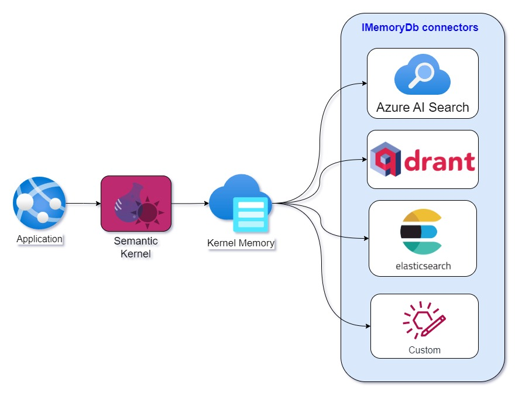

:warning: **This article is a work in progress.** 

# How to build a Kernel Memory connector and use Elasticsearch as vector database - Part 1

**TL;DR:** This article is the first of a series of articles that will guide readers to create their own connectors for [Kernel Memory](https://github.com/microsoft/kernel-memory). It will showcase how to write a basic connector for [Elasticsearch](https://www.elastic.co/elasticsearch/) by implementing the interface [IMemoryDb](https://github.com/microsoft/kernel-memory/blob/main/service/Abstractions/MemoryStorage/IMemoryDb.cs). At the end of this article we will have an almost-complete connector that can be used to create indices and then store and retrieve vectors and payloads from Elasticsearch. Similar code can be used to target other storage systems.

*The source code for this article is located [here](https://github.com/freemindlabsinc/FreeMindLabs.KernelMemory.Elasticsearch).*

## A brief introduction to Kernel Memory

According to [Devis Lucato](https://www.linkedin.com/in/devislucato/) (*Principal Architect at Microsoft - Semantic Kernel & Memory*) we should think about Kernel Memory mostly as a way to:

1. Answer questions.
2. Ground answers exclusively on the data ingested.
3. Provide links and references to the original sources.

Grounding answers on the ingested data helps avoid [hallucinations](https://zapier.com/blog/ai-hallucinations/): Davis stated that "*we fundamentally don't trust AI in autopilot mode. We need a way to audit it.*".

Kernel memory provides the functionality to *ingest and index data* in a way that makes it possible to *answer questions* later. The interface [IMemoryDb](https://github.com/microsoft/kernel-memory/blob/main/service/Abstractions/MemoryStorage/IMemoryDb.cs) and the data structure [MemoryRecord](https://github.com/microsoft/kernel-memory/blob/main/service/Abstractions/MemoryStorage/MemoryRecord.cs) are the means by which Kernel Memory connects to vector databases and storage systems capable of performing vector similarity searches.

---

From a technical point of view, Kernel Memory is an open-source service and plugin specialized in the efficient indexing of datasets through custom continuous data hybrid pipelines. 

<div align="center">
  
</div> 

Utilizing advanced embeddings and LLMs, the system enables Natural Language querying for obtaining answers from the indexed data, complete with citations and links to the original sources.

<div align="center">
  
</div>

It is designed to be used as a service, but it can also be embedded in applications (i.e. serverless model), although with some limitations.

## Connectors
In order to use a vector database or storage system, Kernel Memory needs a connector that implements the interface [IMemoryDb](https://github.com/microsoft/kernel-memory/blob/main/service/Abstractions/MemoryStorage/IMemoryDb.cs). Microsoft currently provides connectors for the following storage systems:

- [Azure AI Search](https://azure.microsoft.com/products/ai-services/ai-search)
  - See [AzureAISearchMemory.cs on Github](https://github.com/microsoft/kernel-memory/tree/main/service/Core/MemoryStorage/AzureAISearch)

- [Qdrant](https://qdrant.tech)
  - See [QdrantMemory.cs on Github](https://github.com/microsoft/kernel-memory/blob/main/service/Core/MemoryStorage/Qdrant/QdrantMemory.cs)

- [Postgres+pgvector](https://github.com/microsoft/kernel-memory-postgres)
  - See [PostgresMemory.cs on Github](https://github.com/microsoft/kernel-memory-postgres)

- Volatile, in-memory KNN records.
  - See [SimpleVectordb.cs on Github](https://github.com/microsoft/kernel-memory/blob/main/service/Core/MemoryStorage/DevTools/SimpleVectorDb.cs)

## Why Elasticssearch?

Elasticsearch supports kNN querying natively in both cloud and on-premise installations. kNN stands for 'K nearest neighbors', and it is a search algorithm that finds the K most similar vectors to a given query vector. Because of this, Elasticsearch is a great candidate for vector database needs in addition to being a great text search engine and real time analytics platform.

>Read more about Elasticsearch kNN search [here](https://www.elastic.co/guide/en/elasticsearch/reference/current/knn-search.html).

Of particular interest is the fact that Elasticsearch's kNN query has a ```filter``` option allow us to pre-filter large chunks of data before performing the kNN search, thus greatly improving overall performance. If you have millions of records in your index you can use the filter to limit the search to a subset of the data, and then perform the kNN search on that subset. *We will see an example of this shortly.*

kNN search and the ```filter``` option make Elasticsearch a great candidate for vector database needs and also enable hybrid search and real time analytics in one platform. If you use Elasticsearch for text (*lexical*) and key-word search, why not use it also for semantic search?


### kNN search using Elastic Query Language

Say that we wanted to get the response to the question *"What do you know of carbon?"* from a set of documents we imported in Kernel Memory, such as that used by the tests in the [article's repository](https://github.com/freemindlabsinc/FreeMindLabs.KernelMemory.Elasticsearch).

The vectorization of the question *"What do you know of carbon?"* will produce a value like the following:

```json
// The vector of 'What do you know of carbon?' 
[-0.00891963486,0.0110242674,-0.0150581468, ...]
```

>*Side node: the array size depends on the model used to generate embeddings. For instance, Open AI uses 1536 dimensions, while SBERT.net's [all-MiniLM-L6-v2](https://huggingface.co/sentence-transformers/all-MiniLM-L6-v2) uses 384 dimensions.*

We can now use this vector to query an index of documents we previously indexed and get back the 10 most similar hits to the query using a EQL query like this one:

```json
// Queries the field 'embedding' (array of float) in the index 'your_index_name' 
// for the 10 most similar vectors to the question `What do you know of carbon?`.

GET your_index_name/_search
{
  "knn": {    
    "field": "embedding",
    "k": 10,
    "num_candidates": 100,
    "query_vector": [-0.00891963486,0.0110242674,-0.0150581468, ...]
  }
}
```

>*To gather results, the kNN search API finds a ```num_candidates number``` of approximate nearest neighbor candidates on each shard. See here for [more details on how kNN search works in Elasticsearch](https://www.elastic.co/guide/en/elasticsearch/reference/current/knn-search.html).*

The results of the query would look like the following (*the value of the field ```embedding``` was truncated*):

```
{
  "took": 0,
  "timed_out": false,
  "_shards": {
    "total": 1,
    "successful": 1,
    "skipped": 0,
    "failed": 0
  },
  "hits": {
    "total": {
      "value": 2,
      "relation": "eq"
    },
    "max_score": 1,
    "hits": [
      {
        "_index": "canimportonedocumentandaskasync",
        "_id": "d=doc001//p=904d05afeeb24c2b99c9ad73fd97e690",
        "_score": 1,
        "_source": {
          "id": "d=doc001//p=904d05afeeb24c2b99c9ad73fd97e690",
          "tags": [
            {
              "name": "__document_id",
              "value": "doc001"
            },
            {
              "name": "__file_type",
              "value": "text/plain"
            },
            {
              "name": "__file_id",
              "value": "0334bca3c83e442ea32f9cac85ff8763"
            },
            {
              "name": "__file_part",
              "value": "d414c1d106524bb2a6eddf51d5b92e18"
            },
            {
              "name": "indexedOn",
              "value": "2023-12-26T21:25:25.885+00:00"
            }
          ],

          "payload": """{"file":"file1-Wikipedia-Carbon.txt","url":"","vector_provider":"AI.OpenAI.OpenAITextEmbeddingGenerator","vector_generator":"TODO","last_update":"2023-12-26T21:25:26"}""",

          "content": """Carbon (from Latin carbo 'coal') is [REDACTED]  copper, which are weaker reducing agents at room temperature.""",

          "embedding": [-0.00891963486,0.0110242674,-0.0150581468, ...]"
        }
      },
      {
        "_index": "canimportonedocumentandaskasync",
        "_id": "d=doc001//p=d1f22975248a4c94bc7a9eabc868df57",
        "_score": 1,
        "_source": {
          "id": "d=doc001//p=d1f22975248a4c94bc7a9eabc868df57",
          "tags": [
            {
              "name": "__document_id",
              "value": "doc001"
            },
            {
              "name": "__file_type",
              "value": "text/plain"
            },
            {
              "name": "__file_id",
              "value": "0334bca3c83e442ea32f9cac85ff8763"
            },
            {
              "name": "__file_part",
              "value": "ac02b3efb75e47e3a3c17823ed44dbaf"
            },
            {
              "name": "indexedOn",
              "value": "2023-12-26T21:25:25.885+00:00"
            }
          ],

          "payload": """{"file":"file1-Wikipedia-Carbon.txt","url":"","vector_provider":"AI.OpenAI.OpenAITextEmbeddingGenerator","vector_generator":"TODO","last_update":"2023-12-26T21:25:26"}""",

          "content": """Carbon sublimes in a carbon arc, which has a temperature [REDACTED] hard tips for cutting tools.""",

          "embedding": [-0.00791963486,0.0120242674,-0.0160581468, ...]"
        }
      }
    ]
  }
}
```

### How to pre-filter data before performing a kNN search

If we had millions of such records we'd need a way to efficiently filter them before performing the kNN search. We can use the ```filter``` option of the kNN query to do that. We could just search documents with ```__file_type = text/plain```, or even just point to a single document with a filter like  ```__document_id = doc001```.

```json
// Pre-filters the data by looking for documents that have 
// a tag with name '__document_id' and value 'doc001'.
// Then performs the kNN search on the filtered data.

GET default/_search
{
  "_source": {
    "excludes": ["embedding", "payload"]
  },
  "knn": {
    "filter": {
      "nested": {
      "path": "tags",
      "query": {
        "bool": {
          "must": [
            {
              "term": {
                "tags.name": {
                  "value": "__document_id"
                }
              }
            },
            {
              "match": {
                "tags.value": "doc001"
              }
            }
          ]
        }
      }
    }
    },
    "field": "embedding",
    "k": 10,
    "num_candidates": 100,
    "query_vector": [-0.00891963486,
      0.0110242674,
      -0.0150581468,
      -0.0392113142,
      -0.0102037108,
      ..]
```

In some situations such as searching for single words or IDs, lexical search may perform better than semantic search. 

The full documentation for Elasticsearch kNN query and examples can be found [here](https://www.elastic.co/guide/en/elasticsearch/reference/current/semantic-search.html#semantic-search-search).

# The connector to Elasticsearch

In order to implement a KM connector for [Elasticsearch](https://www.elastic.co/elasticsearch/), we need to implement the interface [IMemoryDb](https://github.com/microsoft/kernel-memory/blob/main/service/Abstractions/MemoryStorage/IMemoryDb.cs) and to be familiar with the related data structure [MemoryRecord](https://github.com/microsoft/kernel-memory/blob/main/service/Abstractions/MemoryStorage/MemoryRecord.cs). The IMemoryDb interface plays a pivotal role in Kernel Memory, serving as the gateway to store and retrieve vectors and payloads from the indices of a vector database or other storage systems capable of performing vector similarity searches.

This diagram shows the relationship between Kernel Memory and the IMemoryDb interface:

<div align="center">
  
</div>

Kernel Memory can connect to any vector database or storage system if an IMemoryDb connector is available.

## The IMemoryDb interface

The [IMemoryDb](https://github.com/microsoft/kernel-memory/blob/main/service/Abstractions/MemoryStorage/IMemoryDb.cs) interface has seven methods, which can be thought as divided in three groups:

1. Index management
2. Data storage
3. Search

## Index management
These three methods allow to create, list and delete indices where we can store our data.

```csharp
Task CreateIndexAsync(string index, int vectorSize, CancellationToken ancellationToken)

Task DeleteIndexAsync(string index, CancellationToken ancellationToken)

Task<IEnumerable<string>> GetIndexesAsync(CancellationToken cancellationToken)
```

The methods are pretty self-explanatory, but here are some consideration on the arguments of those methods:

- **index**: is the name of the index/collection to create. The name is unique and can be case sensitive in some vector databases. Pay attention when picking names for your indices. Elasticsearch has some [restrictions on index names](https://www.elastic.co/guide/en/elasticsearch/reference/current/indices-create-index.html#indices-create-api-path-params).

- **vectorSize**: the size of the vectors to be stored in the index/collection. The size of the vectors is determined by the vectorization algorithm used to convert text into vectors. 
  - [OpenAI](https://www.openai.com) uses vectors with 1536 dimentiones.
  - [SBERT.net](https://sbert.net)'s all-MiniLM-L6-v2 uses vectors with 384 dimensions.

The unit test [*IndexManagementTests.cs*](../tests/UnitTests/IndexManagementTests.cs) contains the test *CanCreateAndDeleteIndexAsync* which shows how to use *CreateIndexAsync* and *DeleteIndexAsync*.

```csharp
[Fact]
public async Task CanCreateAndDeleteIndexAsync()
{
    var indexName = nameof(CanCreateAndDeleteIndexAsync);
    var vectorSize = 1536;

    // Creates the index using IMemoryDb
    await this.MemoryDb.CreateIndexAsync(indexName, vectorSize)
                       .ConfigureAwait(false);

    // Verifies the index is created using the ES client
    var actualIndexName = ESIndexName.Convert(indexName);
    var resp = await this.Client.Indices.ExistsAsync(actualIndexName)
                                        .ConfigureAwait(false);
    Assert.True(resp.Exists);
    this.Output.WriteLine($"The index '{actualIndexName}' was created successfully.");

    // Deletes the index
    await this.MemoryDb.DeleteIndexAsync(indexName)
                       .ConfigureAwait(false);

    // Verifies the index is deleted using the ES client
    resp = await this.Client.Indices.ExistsAsync(actualIndexName)
                                    .ConfigureAwait(false);
    Assert.False(resp.Exists);
    this.Output.WriteLine($"The index '{actualIndexName}' was deleted successfully.");
}
```

The same unit test also contains the test *CanGetIndicesAsync* which shows how to use *GetIndexesAsync*.

```csharp
[Fact]
    public async Task CanGetIndicesAsync()
    {
        var indexNames = new[]
        {
            $"{nameof(CanGetIndicesAsync)}-First",
            $"{nameof(CanGetIndicesAsync)}-Second"
        };

        // Creates the indices using IMemoryDb
        foreach (var indexName in indexNames)
        {
            await this.MemoryDb.CreateIndexAsync(indexName, 1536)
                               .ConfigureAwait(false);
        }

        // Verifies the indices are returned
        var indices = await this.MemoryDb.GetIndexesAsync()
                                         .ConfigureAwait(false);

        Assert.True(indices.All(nme => indices.Contains(nme)));

        // Cleans up
        foreach (var indexName in indexNames)
        {
            await this.MemoryDb.DeleteIndexAsync(indexName)
                               .ConfigureAwait(false);
        }
    }
```

### Considerations on index management methods

Here are some possible improvements:

- GetIndexesAsync could return an ```IAsyncEnumerable<string>``` instead of an ```IEnumerable<string>```. This would allow to return the list of indices in batches, which would be useful when there are a large number of indices.

- It would be nice if we could have some filters (wildcard at least) in GetIndexesAsync, so that we can filter the list of indices by name (e.g. 'testIndices-*')

## Data storage

The next two methods allow to *upsert* (i.e. to insert rows into a database table if they do not already exist, or update them if they do) and to *delete* the information inside indices using the data structure [MemoryRecord](https://github.com/microsoft/kernel-memory/blob/main/service/Abstractions/MemoryStorage/MemoryRecord.cs). 

```csharp
Task<string> UpsertAsync(string index, MemoryRecord record, CancellationToken cancellationToken = default(CancellationToken));

Task DeleteAsync(string index, MemoryRecord record, CancellationToken cancellationToken = default(CancellationToken));
```

### MemoryRecord

[MemoryRecord](https://github.com/microsoft/kernel-memory/blob/main/service/Abstractions/MemoryStorage/MemoryRecord.cs) is a class that contains vector data as well as information such as tags and payload to be stored in our indices.

When we upload a file to Kernel Memory, the text of the file gets chunked into smaller pieces so that we can retrieve results at a more granular level. Each of these chunks is stored as a MemoryRecord.

>You can see a simple example of how chunking is done in the method *UpsertTextFilesAsync* of the unit test [DataStorageTests.cs](../tests/UnitTests/DataStorageTests.cs).

MemoryRecord It is declared as follows:

```csharp
public class MemoryRecord
{    
    public string Id { get; set; } = string.Empty;

    public Embedding Vector { get; set; } = new();

    public TagCollection Tags { get; set; } = new();

    public Dictionary<string, object> Payload { get; set; } = new();
}
```

- The property ```Id``` is a unique identifier for the record.
  - Ids are currently formatted like ```d=doc001//p=904d05afeeb24c2b99c9ad73fd97e690``` where the ```d``` part is the document id and the ```p``` part is the id of the document partition (chunk). 


- The property ```Vector``` is the vector to be stored in the index. See the type [Embedding](https://github.com/microsoft/kernel-memory/blob/main/service/Abstractions/AI/Embedding.cs).

- The property ```Tags``` is a collection of key-value pairs that can be used to filter the data when performing searches. 
  - Multiple values per keys are supported (e.g. ```"Collection=Work", "Project=1", "Project=2", "Project=3", "Type=Chat", "LLM=AzureAda2"```). 
  - Uses cases include 
    - Collections, e.g. [ "Collection=Project1", "Collection=Work" ]
    - Folders, e.g. [ "Folder=Inbox", "Folder=Spam" ]
    - Content types, e.g. [ "Type=Chat" ]
    - Versioning, e.g. [ "LLM=AzureAda2", "Schema=1.0" ]
    - etc.   

- The property ```Payload``` is a dictionary of key-value pairs that can be used to store additional information about the record. The payload is not searchable, but it can be retrieved when the record is returned from a search. 
    - Use cases include 
        - Citations
        - Original text
        - Descriptions
        - Embedding generator name
        - URLs
        - Content type
        - Timestamps
        - etc.

You can see an example of how to create a MemoryRecord in the method *UpsertTextFilesAsync* of the unit test [DataStorageTests.cs](../tests/UnitTests/DataStorageTests.cs).

### A MemoryRecord in Elasticsearch

This is how a memory record structure is translated in an Elasticsearch index mapping.

```
{
  "your_index_name_": {
    "mappings": {
      "properties": {
        "id": {
          "type": "keyword"
        },
        "tags": {
          "type": "nested",
          "properties": {
            "name": {
              "type": "keyword"
            },
            "value": {
              "type": "text"
            }
          }
        },
        "payload": {
          "type": "text",
          "index": false
        },
        "content": {
          "type": "text"
        },
        "embedding": {
          "type": "dense_vector",
          "dims": 1536,
          "index": true,
          "similarity": "cosine"
        }        
      }
    }
  }
}
```

And this is the data stored in one of such memory record:

```
{
    "_index": "your_index_name",
    "_id": "d=doc001//p=904d05afeeb24c2b99c9ad73fd97e690",
    "_score": 1,
    "_source": {
      
      "id": "d=doc001//p=904d05afeeb24c2b99c9ad73fd97e690",

      "tags": [
        {
          "name": "__document_id",
          "value": "doc001"
        },
        {
          "name": "__file_type",
          "value": "text/plain"
        },
        {
          "name": "__file_id",
          "value": "0334bca3c83e442ea32f9cac85ff8763"
        },
        {
          "name": "__file_part",
          "value": "d414c1d106524bb2a6eddf51d5b92e18"
        },
        {
          "name": "indexedOn",
          "value": "2023-12-26T21:25:25.885+00:00"
        }
      ],
            
      "payload": """{"file":"file1-Wikipedia-    arbon.txt","url":"","vector_provider":"AI.OpenAI.OpenAITextEmbeddingGenerator","vector_generator":"TODO","last_update":"2023-12-26T21:25:6"}""" ,
    
      "content": """Carbon (from Latin carbo 'coal') is [REDACTED]  copper, which are weaker reducing agents at room temperature.""",
    
      "embedding": [-0.00891963486,0.0110242674,-0.0150581468, ...]"
    }      
}
```

### UpsertAsync and DeleteAsync

The methods to insert-update and delete MemoryRecords are defined as follows:

```csharp
Task<string> UpsertAsync(string index, MemoryRecord record, CancellationToken ancellationToken)

Task DeleteAsync(string index, MemoryRecord record, CancellationToken ancellationToken)
```

An example of how to use UpsertAsync and DeleteAsync is in the unit test [DataStorageTests.cs](../tests/UnitTests/DataStorageTests.cs).

```
[Fact]
public async Task CanUpsertOneTextDocumentAndDeleteAsync()
{
    // We upsert the file
    var docIds = await this.UpsertTextFilesAsync(
       indexName: nameof(CanUpsertOneTextDocumentAndDeleteAsync),
       fileNames: new[]
       {
          Data/file1-Wikipedia-Carbon.txt"
       }).ConfigureAwait(false);

    // Waits for indexing to complete
    await this.Client.WaitForDocumentsAsync(nameof(CanUpsertOneTextDocumentAndDeleteAsync), expectedDocuments: 3)
                     .ConfigureAwait(false);

    // Deletes the document
    var deletes = docIds.Select(id => new MemoryRecord()
    {
        Id = id
    });

    foreach (var deleteRec in deletes)
    {
        await this.MemoryDb.DeleteAsync(nameof(CanUpsertOneTextDocumentAndDeleteAsync), deleteRec)
                           .ConfigureAwait(false);
    }

    // Verfiies that the documents are gone
    await this.Client.WaitForDocumentsAsync(nameof(CanUpsertOneTextDocumentAndDeleteAsync), expectedDocuments: 0)
                     .ConfigureAwait(false);
}
```

> [TBC or TO REMOVE]
There is no distinction between inserting and updating a record: ```Upsert``` does both things:
    - If the record exists, it will be updated. 
      - The method should return the same value of ```record.Id``` of the submitted record.
    - If it doesn't exist, it will be inserted and a new id will be generated and returned.
      - [TO VERIFY] what happens to record.id if its null and we upsert?
        - Q1: Does it generate a new id and return it? (preferrable)
          - Does record.id get updated like Entity Framework would do?
        - Q2: Or does it expect the new ```record.Id``` to be populated by the client?             

Possible improvements:

1. Upsert and DeleteAsync should be able to accept a list of MemoryRecords to be inserted/updated/deleted. This would allow to perform batch operations and improve performance.

2. It would be beneficial to have methods like ES's DeleteByQuery to speed up deletions.

3. There should be a Delete that just takes the index and the id(s) of the records to be deleted. This would be useful to delete records by id without having to create a MemoryRecord object.

### Considerations on ids and performance 

Pay special consideration to the ```Id``` property of MemoryRecord.
Having ids that are balanced across shards is important for performance reasons.

> In distributed systems like Elasticsearch, the effectiveness of data retrieval and storage operations is greatly influenced by how the data is distributed across different shards. This distribution is heavily reliant on the mechanism used for generating IDs.

When IDs are poorly generated, such as in sequential order or with common prefixes, it can lead to uneven distribution of data. This uneven distribution results in certain shards bearing a disproportionate amount of the data load, creating hotspots. These hotspots can significantly degrade the performance of the system, as these overloaded shards become bottlenecks for both read and write operations. For example, if sequential IDs like 0001, 0002, 0003... are used, they might all be directed to the same shard, leading to an imbalance in the load distribution.

Conversely, a well-thought-out ID generation strategy can mitigate these issues. By creating IDs that are evenly and randomly distributed, the data is spread more uniformly across all available shards. This can be achieved through algorithms that produce a randomized distribution of IDs, such as hashing algorithms. Such an approach leads to a more balanced shard load, which not only improves the system's efficiency and response times but also enhances its scalability and resilience to high volumes of data and requests.


## Search

The final two methods are used to search the indices and get back the MemoryRecords we stored.

Indices can be searched by using ```filters``` and/or ```text```.

```csharp
IAsyncEnumerable<(MemoryRecord, double)> GetSimilarListAsync(
  string index, 
  string text, 
  ICollection<MemoryFilter>? filters = null, 
  double minRelevance = 0, 
  int limit = 1, 
  bool withEmbeddings = false,
  CancellationToken cancellationToken = default)

IAsyncEnumerable<MemoryRecord> GetListAsync(
  string index,
  ICollection<MemoryFilter>? filters = null,
  int limit = 1,
  bool withEmbeddings = false,
  CancellationToken cancellationToken = default)
```

An example of how to use GetSimilarListAsync and GetListAsync is in the unit test [SearchTests.cs](../tests/UnitTests/DataStorageTests.cs).

```csharp
[Fact]
public async Task CanUpsertTwoTextFilesAndGetSimilarListAsync()
{
    await this.UpsertTextFilesAsync(
       indexName: nameof(CanUpsertTwoTextFilesAndGetSimilarListAsync),
       fileNames: new[]
       {
               "Data/file1-Wikipedia-Carbon.txt",
               "Data/file2-Wikipedia-Moon.txt"
       }).ConfigureAwait(false);

    // Waits for the indexing to complete.
    await this.Client.WaitForDocumentsAsync(nameof(CanUpsertTwoTextFilesAndGetSimilarListAsync), expectedDocuments: 4)
                     .ConfigureAwait(false);


    // Gets documents that are similar to the word "carbon" .
    var foundSomething = false;

    var textToMatch = "carbon";
    await foreach (var result in this.MemoryDb.GetSimilarListAsync(
        index: nameof(CanUpsertTwoTextFilesAndGetSimilarListAsync),
        text: textToMatch,
        limit: 1))
    {
        this.Output.WriteLine($"Found a document matching '{textToMatch}': {result.Item1.Payload["file"]}.");
        return;
    };

    Assert.True(foundSomething, "It should have found something...");
}
```

Here are some considerations:

- Both methods return an ```IAsyncEnumerable``` of MemoryRecords.
The Results of a search are not returned all at once, but rather in batches, ordered by a relevance score.

  - The caller can then asynchronously iterate over the results as they are returned.

  - The caller can also stop the search at any time, and only get back the results that have been returned so far.

# Conclusion

I hope this article has been helpful and that it has given you a good understanding of how to build a mostly functioning IMemoryDb connector for Kernel Memory.

In the next article we will dive deeper in search, and we will add support for [MemoryFilter](https://github.com/microsoft/kernel-memory/blob/main/service/Abstractions/Models/MemoryFilter.cs) while exploring ways to use the ```filter``` option of Elasticsearch kNN query.