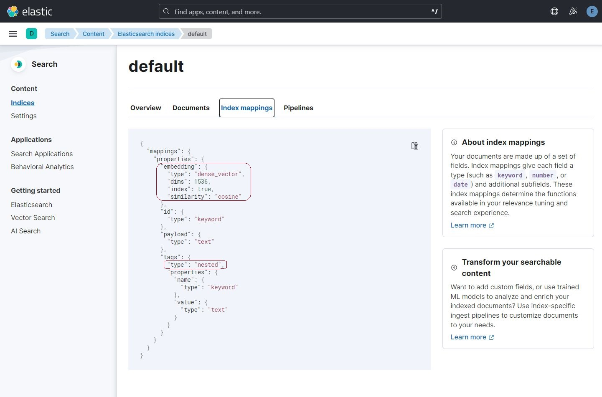

:warning: **This article is a work in progress.** 

# Objective

This article is the first of a series of articles that will guide readers to create their own connectors for [Kernel Memory](https://github.com/microsoft/kernel-memory). It will do so by showcasing how to write a connector for [Elasticsearch](https://www.elastic.co/elasticsearch/). 

At the end of this article we will have an almost-complete connector that can be used to create indices and then store and retrieve vectors and payloads from Elasticsearch.

Similar code can be used to target any other vector database or storage system in the market.

## A brief introduction to Kernel Memory

According to [Devis Lucato](https://www.linkedin.com/in/devislucato/) (*Principal Architect at Microsoft - Semantic Kernel & Memory*) we should think about Kernel Memory mostly as a way to:

1. Answer questions.
2. Ground answers exclusively on the data ingested.
3. Provide links and references to the original sources.

To **answer questions** is the main goal of Kernel Memory and that needs to happen **after grounding the answers** on our selected data.

Not only this helps avoiding [hallucinations](https://zapier.com/blog/ai-hallucinations/); Davis stated that "*we fundamentally don't trust AI in autopilot mode. We need a way to audit it.*"

It's implied Kernel memory also provides the functionality to **ingest data** and **index it** in a way that makes it possible to **answer questions**.

---

From a technical point of view, Kernel Memory is an open-source service and plugin specialized in the efficient indexing of datasets through custom continuous data hybrid pipelines. 

<div align="center">
  
</div> 

Utilizing advanced embeddings and LLMs, the system enables Natural Language querying for obtaining answers from the indexed data, complete with citations and links to the original sources.

<div align="center">
  
</div>

## Connectors
In order to operate, Kernel Memory needs to connect to a vector database or storage system that is capable of performing vector similarity searches.

Microsoft currently provides connectors for the following storage systems:

- [Azure AI Search](https://azure.microsoft.com/products/ai-services/ai-search)
  - See [AzureAISearchMemory.cs on Github](https://github.com/microsoft/kernel-memory/tree/main/service/Core/MemoryStorage/AzureAISearch)
- [Qdrant](https://qdrant.tech)
  - See [QdrantMemory on Github](https://github.com/microsoft/kernel-memory/blob/main/service/Core/MemoryStorage/Qdrant/QdrantMemory.cs)
- [Postgres+pgvector](https://github.com/microsoft/kernel-memory-postgres)
  - See [PostgresMemory.cs on Github](https://github.com/microsoft/kernel-memory-postgres)
- Volatile, in-memory KNN records.
  - See [SimpleVectordb.cs on Github](https://github.com/microsoft/kernel-memory/blob/main/service/Core/MemoryStorage/DevTools/SimpleVectorDb.cs)

### A connector to Elasticsearch

In this article we will begin to implement a connector for [Elasticsearch](https://www.elastic.co/elasticsearch/), so that we can use Elasticsearch's *native* vector search capabilities, alongside powerful text search and real time analytics.

To implement a connector we need to implement the interface [IMemoryDb](https://github.com/microsoft/kernel-memory/blob/main/service/Abstractions/MemoryStorage/IMemoryDb.cs) and to be familiar with the related data structure [MemoryRecord](https://github.com/microsoft/kernel-memory/blob/main/service/Abstractions/MemoryStorage/MemoryRecord.cs). 


>*In the next article we will complete the connector by adding support for  [MemoryFilter](https://github.com/microsoft/kernel-memory/blob/main/service/Abstractions/Models/MemoryFilter.cs), which will allow the connector to (pre)filter datasets in multiple ways (i.e. key-based, full-text and semantic), and will enable powerful search that extend semantic search.*

The repository associated to this article is located [here](https://www.github.com/freemindlabsinc/FreeMindLabs.SemanticKernel).


## Why Elasticssearch

Elasticsearch supports kNN querying natively in both cloud and on-premise installations. In addition, kNN filtering options allow us to pre-filter large chunks of data before performing the kNN search, thus improving overall performance.

>KNN stands for 'K nearest neighbors', and it is a search algorithm that finds the K most similar vectors to a given query vector. Read more about it [here](https://en.wikipedia.org/wiki/K-nearest_neighbors_algorithm).

### An example

Text embeddings produced by dense vector models can be queried using a kNN search. 

Say that we wanted to get the response to the question *"What's Semantic Kernel?"* from a set of documents we imported in Kernel Memory. The vectorization of the question produces values like the following:

```json
// The array size depend on the model you use to generate embeddings.
// Open AI uses 1536 dimensions, while SBERT.net's all-MiniLM-L6-v2 uses 384 dimensions.
[-0.00891963486,0.0110242674,-0.0150581468,-0.0392113142,-0.0102037108, ...]
```

In the kNN clause, provide the name of the dense vector field (```embedding``` in our case), and a ```query_vector``` array with the embedding generated from the user "ask".


```json
// Queries the index 'default' and the field 'embedding' for the 10 most similar vectors to the ask  `What's Semantic Kernel?`.

GET default/_search
{
  "knn": {    
    "field": "embedding",
    "k": 10,
    "num_candidates": 100,
    "query_vector": [-0.00891963486,0.0110242674,-0.0150581468, ...]
  }
}
```

T

```json
GET default/_search
{
  "_source": {
    "excludes": ["embedding", "payload"]
  },
  "knn": {
    "filter": {
      "nested": {
      "path": "tags",
      "query": {
        "bool": {
          "must": [
            {
              "term": {
                "tags.name": {
                  "value": "__document_id"
                }
              }
            },
            {
              "match": {
                "tags.value": "doc001"
              }
            }
          ]
        }
      }
    }
    },
    "field": "embedding",
    "k": 10,
    "num_candidates": 100,
    "query_vector": [-0.00891963486,
      0.0110242674,
      -0.0150581468,
      -0.0392113142,
      -0.0102037108,
      ..]
```

The full documentation and examples can be found [here](https://www.elastic.co/guide/en/elasticsearch/reference/current/semantic-search.html#semantic-search-search).

### Beyond semantic search with hybrid search

From the Elasticsearch [documentation](https://www.elastic.co/guide/en/elasticsearch/reference/current/semantic-search.html#semantic-search-hybrid-search):

*In some situations, lexical search may perform better than semantic search. 
For example, when searching for single words or IDs, like product numbers.*

*Combining semantic and lexical search into one hybrid search request using reciprocal rank fusion provides the best of both worlds. Not only that, but hybrid search using reciprocal rank fusion has been shown to perform better in general.*

Hybrid search between a semantic and lexical query can be achieved by providing:
- a query clause that limits the dataset over which to perform kNN search.
- a knn clause with the kNN search that queries the dense vector field.
- a rank clause with the rrf parameter to rank documents using reciprocal rank fusion.
```
GET my-index/_search
{
  "query": {
    "match": {
      "my_text_field": "the query string"
    }
  },
  "knn": {
    "field": "text_embedding.predicted_value",
    "k": 10,
    "num_candidates": 100,
    "query_vector_builder": {
      "text_embedding": {
        "model_id": "sentence-transformers__msmarco-minilm-l-12-v3",
        "model_text": "the query string"
      }
    }
  },
  "rank": {
    "rrf": {}
  }
}
```

One of the long term goals for the connector is to be able to support hybrid searches of this kind, thus allowing the efficiency 

# What is IMemoryDb?

The IMemoryDb interface plays a pivotal role in Kernel Memory, serving as the gateway to store and retrieve vectors and payloads from the indices of a vector database or other storage systems capable of performing vector similarity searches.

This diagram shows the relationship between Kernel Memory and the IMemoryDb interface:

<div align="center">
  
</div>

Kernel Memory can connect to several any databases and storage system if a connector is available.

>TODO: should the diagram show Application using KM directly?

## The IMemoryDb interface

The [IMemoryDb](https://github.com/microsoft/kernel-memory/blob/main/service/Abstractions/MemoryStorage/IMemoryDb.cs) interface has seven methods, which can be thought as divided in three groups:

1. Index management
2. Data manipulation
3. Search

## Index management
These three methods allow to create, list and delete indices:

```csharp
Task CreateIndexAsync(string index, int vectorSize, CancellationToken ancellationToken)

Task<IEnumerable<string>> GetIndexesAsync(CancellationToken cancellationToken)

Task DeleteIndexAsync(string index, CancellationToken ancellationToken)
```

Here are some consideration on the arguments of those methods:

- **index**: is the name of the index/collection to create. The name is unique and can be case sensitive in some vector databases. Pay attention when picking names for your indices.

- **vectorSize**: the size of the vectors to be stored in the index/collection. The size of the vectors is determined by the vectorization algorithm used to convert text into vectors. 
  - [OpenAI](https://www.openai.com) uses vectors with 1536 dimentiones.
  - [SBERT.net](https://sbert.net)'s all-MiniLM-L6-v2 uses vectors with 384 dimensions.

In addition, notice that (at the time of writing) the result of GetIndexesAsync is an ```IEnumerable<string>```, which means that the method returns the full list of indices at once. Be careful when calling this method on vector databases that contain a large number of indices.

Here are some possible improvements:

4. GetIndexesAsync could return an ```IAsyncEnumerable<string>``` instead of an ```IEnumerable<string>```. This would allow to return the list of indices in batches, which would be useful when there are a large number of indices.

5. It would be nice if we could have some filters (wildcard at least) in GetIndexesAsync, so that we can filter the list of indices by name (e.g. 'testIndices-*')

> TODO: put implementation code for methods here
> TODO: put code of index mgmt tests here

## Data manipulation

The next two methods allow to update and delete the information inside indices using the data structure [MemoryRecord](https://github.com/microsoft/kernel-memory/blob/main/service/Abstractions/MemoryStorage/MemoryRecord.cs).

### MemoryRecord

MemoryRecord is a class that contains vector information and its related payload. It is defined as follows:

```csharp
public class MemoryRecord
{
    /// <summary>
    /// Unique record ID
    /// </summary>
    [JsonPropertyName("id")]
    [JsonPropertyOrder(1)]
    public string Id { get; set; } = string.Empty;

    /// <summary>
    /// Embedding vector
    /// </summary>
    [JsonPropertyName("vector")]
    [JsonPropertyOrder(100)]
    [JsonConverter(typeof(Embedding.JsonConverter))]
    public Embedding Vector { get; set; } = new();

    /// <summary>
    /// Optional Searchable Key=Value tags (string => string[] collection)
    ///
    /// Multiple values per keys are supported.
    /// e.g. [ "Collection=Work", "Project=1", "Project=2", "Project=3", "Type=Chat", "LLM=AzureAda2" ]
    ///
    /// Use cases:
    ///  * collections, e.g. [ "Collection=Project1", "Collection=Work" ]
    ///  * folders, e.g. [ "Folder=Inbox", "Folder=Spam" ]
    ///  * content types, e.g. [ "Type=Chat" ]
    ///  * versioning, e.g. [ "LLM=AzureAda2", "Schema=1.0" ]
    ///  * etc.
    /// </summary>
    [JsonPropertyName("tags")]
    [JsonPropertyOrder(2)]
    public TagCollection Tags { get; set; } = new();

    /// <summary>
    /// Optional Non-Searchable payload processed client side.
    ///
    /// Use cases:
    ///  * citations
    ///  * original text
    ///  * descriptions
    ///  * embedding generator name
    ///  * URLs
    ///  * content type
    ///  * timestamps
    ///  * etc.
    /// </summary>
    [JsonPropertyName("payload")]
    [JsonPropertyOrder(3)]
    public Dictionary<string, object> Payload { get; set; } = new();
}
```

To understant MemoryRecord, we need to think Retrival Augmented Generation (RAG).

Say we have a large text document (e.g. 2Mb), and we want to store it in a vector database for later retrieval or AI generation/completion.

- First we need to extract the text from the PDF. 
  - Kernel Memory does this for us through the use of classes such as [PdfDecoder](https://github.com/microsoft/kernel-memory/blob/main/service/Core/DataFormats/Pdf/PdfDecoder.cs).
  - PdfDecoder is one of the many decorders used by the [TextExtractionHandler](https://github.com/microsoft/kernel-memory/blob/main/service/Core/Handlers/TextExtractionHandler.cs).

- When we upload textual data to a vector database, we have to first split the complete text into smaller 'chunks'. *Each chunk becomes a MemoryRecord.*
  - Often chunks are sentences, but they can be paragraphs, or even smaller pieces of text. 
  - The idea is that we don 't want to upload the whole text as a single vector, because that would make it impossible to search for specific parts of the text.

  - KernelMemory does this for us, behind the scenes. 
    - When we upload text, KernelMemory will split it into smaller pieces, and then convert each piece into a vector. It will then also add information such as the source document, the position of the chunk in the document, etc. inside the property ```payload``` which is an array of key-value pairs.

### A MemoryRecord in Elasticsearch

This is how a memory record structure is translated in an Elasticsearch index mapping.

>TODO: change the name of the field 'embedding' to 'vector'

<div align="center">
  
</div>


And this is the data stored in one of such memory record:

<div align="center">
  
  
</div>

> TODO: Ask Davis for some screenshots/data from the Azure services that shows similar stuff


What we store and search in vector databases are collections of MemoryRecords.
These collection tend to become populated with a large number of records, and they are often sharded across multiple nodes.

### UpsertAsync and DeleteAsync

The methods to insert-update and delete MemoryRecords are defined as follows:

```csharp
Task<string> UpsertAsync(string index, MemoryRecord record, CancellationToken ancellationToken)

Task DeleteAsync(string index, MemoryRecord record, CancellationToken ancellationToken)
```

Here are some considerations:

1. There is no distinction between inserting and updating a record: ```Upsert``` does both things:
    - If the record exists, it will be updated. 
      - The method should return the same value of ```record.Id``` of the submitted record.
    - If it doesn't exist, it will be inserted and a new id will be generated and returned.
      - [TO VERIFY] what happens to record.id if its null and we upsert?
        - Q1: Does it generate a new id and return it? (preferrable)
          - Does record.id get updated like Entity Framework would do?
        - Q2: Or does it expect the new ```record.Id``` to be populated by the client?             

Possible improvements:

1. Upsert and DeleteAsync should be able to accept a list of MemoryRecords to be inserted/updated/deleted. This would allow to perform batch operations and improve performance.

2. It would be beneficial to have methods like ES's DeleteByQuery to speed up deletions.

3. There should be a Delete that just takes the index and the id(s) of the records to be deleted. This would be useful to delete records by id without having to create a MemoryRecord object.

> TODO: put implementation code for methods here
> TODO: put code of CRUD tests here

### Considerations on ids and performance 

Pay special consideration to the ```Id``` property of MemoryRecord.
Having ids that are balanced across shards is important for performance reasons.

> In distributed systems like Elasticsearch, the effectiveness of data retrieval and storage operations is greatly influenced by how the data is distributed across different shards. This distribution is heavily reliant on the mechanism used for generating IDs.

When IDs are poorly generated, such as in sequential order or with common prefixes, it can lead to uneven distribution of data. This uneven distribution results in certain shards bearing a disproportionate amount of the data load, creating hotspots. These hotspots can significantly degrade the performance of the system, as these overloaded shards become bottlenecks for both read and write operations. For example, if sequential IDs like 0001, 0002, 0003... are used, they might all be directed to the same shard, leading to an imbalance in the load distribution.

Conversely, a well-thought-out ID generation strategy can mitigate these issues. By creating IDs that are evenly and randomly distributed, the data is spread more uniformly across all available shards. This can be achieved through algorithms that produce a randomized distribution of IDs, such as hashing algorithms. Such an approach leads to a more balanced shard load, which not only improves the system's efficiency and response times but also enhances its scalability and resilience to high volumes of data and requests.


## Search

The final two methods are used to search the indices and get back the MemoryRecords we stored.

Indices can be searched by using ```filters``` and/or ```text```.

```csharp
IAsyncEnumerable<(MemoryRecord, double)> GetSimilarListAsync(
  string index, 
  string text, 
  ICollection<MemoryFilter>? filters = null, 
  double minRelevance = 0, 
  int limit = 1, 
  bool withEmbeddings = false,
  CancellationToken cancellationToken = default)

IAsyncEnumerable<MemoryRecord> GetListAsync(
  string index,
  ICollection<MemoryFilter>? filters = null,
  int limit = 1,
  bool withEmbeddings = false,
  CancellationToken cancellationToken = default)
```

Here are some considerations:

- Both methods return an ```IAsyncEnumerable``` of MemoryRecords.
The Results of a search are not returned all at once, but rather in batches, ordered by a relevance score.

  - The caller can then asynchronously iterate over the results as they are returned.

  - The caller can also stop the search at any time, and only get back the results that have been returned so far.

Possible improvements:

1. I would simply make the ```text``` p[roperty of the first overload to be nullable.
  - If a ```null``` value is passed in ```text```, then the search will be performed without a text query.


> TODO: put implementation of search here
> TODO: put code of sample for semantic search here

## The complete implementation of the Elasticsearch connector

> show [code here](https://github.com/freemindlabsinc/FreeMindLabs.SemanticKernel/blob/main/src/ElasticsearchMemoryStorage/ElasticsearchMemory.cs)

> TODO: make sure URL is good after changing repo name.

## Where do we go from here?

>explain that we will add support for filters in the next article bla bla

In the next article we will complete the connector by adding support for  [MemoryFilter](https://github.com/microsoft/kernel-memory/blob/main/service/Abstractions/Models/MemoryFilter.cs), and we will see how we cann even extend this and other classes to support more complex filters.
