# Installing the Elastic Stack using Docker Compose

There are several ways to install and run the Elastic Stack on a development  machine. We will install the Elastic Stack using Docker Compose as inspired by the articles of [Eddie Mitchell](https://www.elastic.co/blog/author/eddie-mitchell). 

The necessary files have been copied in the ```/docker``` folder so that we can run it directly without the need to Mitchell's repository, and so that we can alter them as necessary in the future.

The files we might need to access and change have also been grouped under the solution folder ```docker```:

<div align="center">
    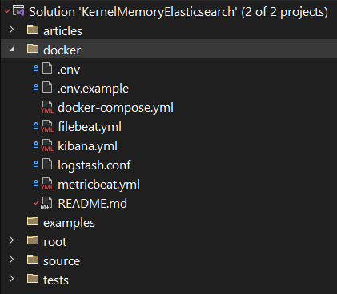
</div>

- **.env**: this file contains the environment variables that will be used by Docker Compose. 
    1. :warning: **The .env file needs to be created manually**, as it is not part of the repository. **Without this file, Docker Compose will not work.**
    1. To create a valid .env file, copy the contents of the .env.example file and paste them into a new file named .env. Then, update the values of the variables as needed.

- **.env.example**: [this file](/.env.example) contains a complete example of all the options available. 
  - It is not used by Docker Compose, and it should only be used as a reference when creating the .env file. This is how such file reads:

> :warning: **IMPORTANT**: the default username/password for Kibana and Elasticsearch is ```elastic```/```changeme```. You can change the password in your .env file.

<div align="center">
    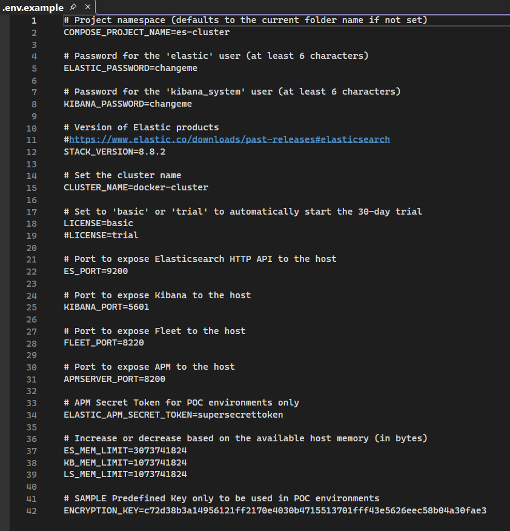
</div>

- **docker-compose.yml**: [this file](./docker-compose.yml) contains the configuration for Docker Compose. The compose file will allow us to run the Elastic Stack on a single machine and get access to the Elasticsearch, Kibana, Logstash, Filebeat, and Metricbeat.

The remaining files allow to configure options of the individual services. It's unlikely that you will have to change any of them at the beginning.

- **filebeat.yml**: This file contains the configuration for Filebeat. It is used by the Filebeat container to collect and ship logs to Elasticsearch. *It's is unlikely you will need to change this file.*

- **kibana.yml**: This file contains the configuration for Kibana. It is used by the Kibana container to connect to Elasticsearch.

- **logstash.yml**: This file contains the configuration for Logstash. It is used by the Logstash container to connect to Elasticsearch. *It's is unlikely you will need to change this file.*

- **metricbeat.yml**: This file contains the configuration for Metricbeat. It is used by the Metricbeat container to collect and ship metrics to Elasticsearch.
  *It's is unlikely you will need to change this file.*

- **README.md**: this file.


## High level overview

From a high-level perspective, the Elastic Stack we will launch is composed of the following components:

<div align="center">
    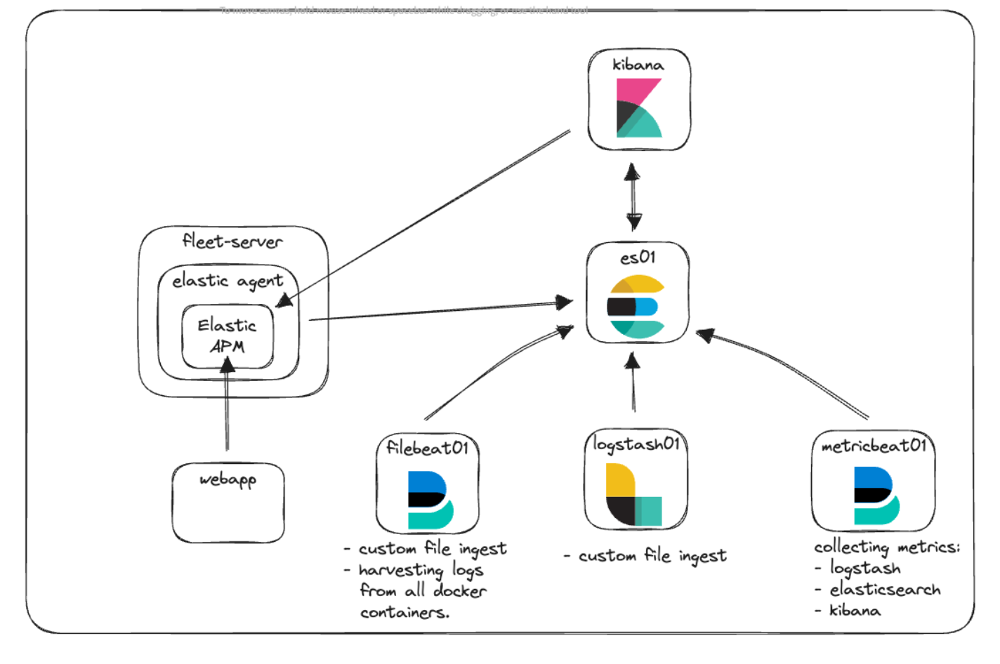
</div>

- **Elasticsearch** (es01): This is the heart of the Elastic Stack, acting as a powerful and scalable search engine. It stores, indexes, and retrieves data, allowing for fast and efficient searching and analysis.

- **Kibana** (kibana): It serves as the visualization layer in the Elastic Stack. It offers a user-friendly interface to visualize data stored in Elasticsearch. With Kibana, you can create and share dashboards, charts, and reports, making data analysis accessible and insightful, even for those new to data analytics.

- **Logstash** (logstash01): A data processing pipeline that ingests, transforms, and sends data to Elasticsearch. Logstash allows you to collect data from various sources, process it with a wide range of filters, and enhance it before it gets indexed in Elasticsearch.

- **Filebeat** (filebeat01): Acting as a lightweight log shipper, Filebeat forwards log data from multiple sources directly to Elasticsearch or Logstash. It simplifies data collection, is resource-efficient, and is ideal for collecting and aggregating log data in real time.

- **Metricbeat** (metricbeat01): Similar to Filebeat but focused on metrics, Metricbeat collects various system and service metrics. It's essential for real-time monitoring of servers and services, providing valuable insights into their performance and health.

## The running environment

Once you launch the docker compose file, you will have access to the Kibana, from where you will do most of your work:

<div align="center">
    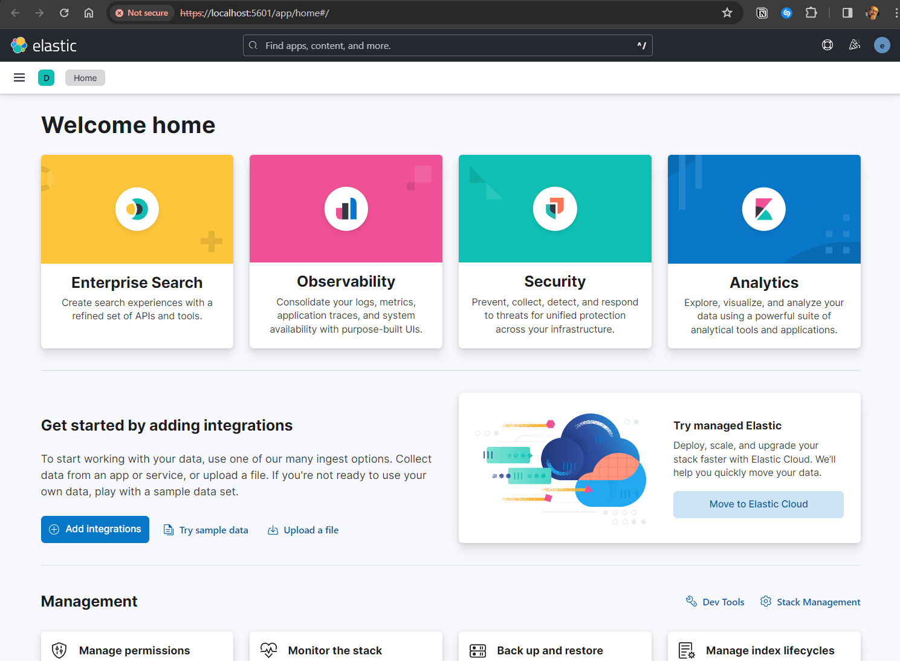</img>
    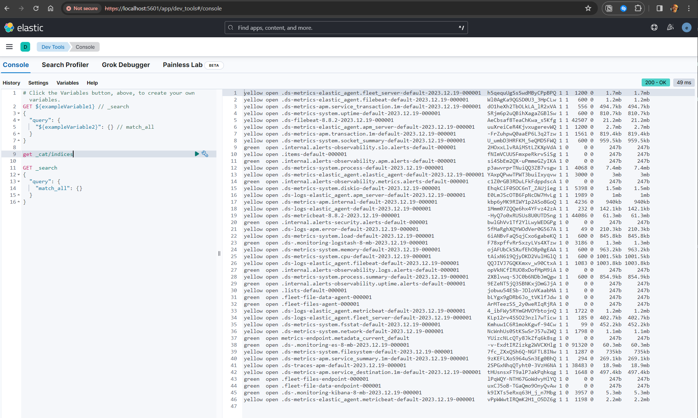</img>    
</div>

The following sections will guide you through the installation process.

## The configuration files

Make sure you created the **.env** file as explained above.

## Step 1/3: Ensure the vm.max_map_count setting is set to at least 262144

When setting up Elasticsearch, it's essential to configure the `vm.max_map_count` kernel setting to at least `262144`. This setting is critical for Elasticsearch to startup and to function. 

:warning: This change has to be made on the docker host, not inside the container.

There are two ways to set `vm.max_map_count`:

1. Temporary:
   - This method is quick and useful for testing purposes. The setting can be changed temporarily by executing a command on your Docker host. It's an immediate change but won't persist after a system reboot. Here's how to do it:

   ```bash
   # Set vm.max_map_count temporarily
   sysctl -w vm.max_map_count=262144
   ```

   *This approach is ideal when you need to quickly set up Elasticsearch for short-term use or testing, without the need for the setting to persist after a reboot.*

1. Permanent (reccommended):
   - For long-term use, especially in containerized environments like Docker, you'll want this setting to be permanent. This requires editing a system configuration file to ensure the setting persists across reboots and container restarts. Follow these steps:

   ```bash
   # Edit the sysctl configuration file for persistent changes
   echo 'vm.max_map_count=262144' >> /etc/sysctl.conf
   
   # Apply the changes without rebooting
   sysctl -p
   ```

Additional information can be found [here](https://www.elastic.co/guide/en/elasticsearch/reference/current/vm-max-map-count.html) and in Eddie Mitchell's [original article](https://www.elastic.co/blog/getting-started-with-the-elastic-stack-and-docker-compose-part-2).

## Step 2/3: Launch the docker compose file

Launch a terminal and navigate to the `docker` directory of this repo. 
Then run the following command:

```bash
docker-compose up
```

Be prepared to wait a minute or two for the containers to start up.
In the end your terminal should display something like this:

<div align="center">
    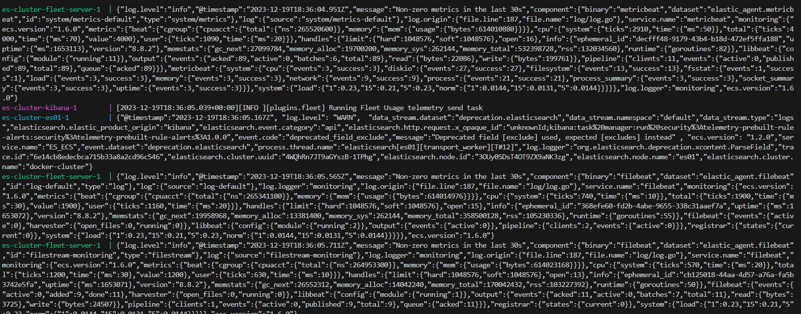</img>
</div>

Once the containers are up and running and finish their initial setup you will be able to access the Kibana UI at https://localhost:5601.
<div align="center">
    </img>   
</div>

The Elasticsearch API at https://localhost:9200.
<div align="center">
    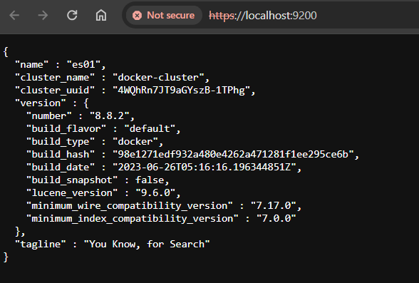</img>
</div>

And, from inside Docker desktop, our Compose should look like this:

<div align="center">
    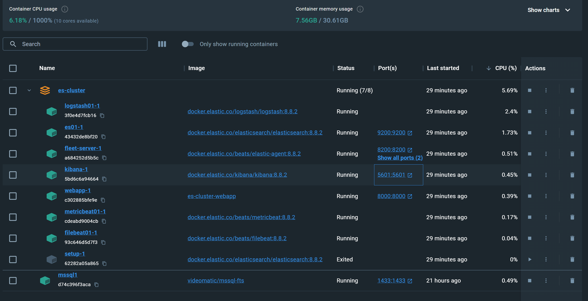</img>
</div>

### Step 3/3: Adjust the Settings of Elastic Agent

Now that Elasticsearch and Kibana are running we can apply our last configuration step: adjust the settings of the Elastic Agent which is currently not working as expected.

To see the problem, click on 'Management Fleet':
<div align="center">
    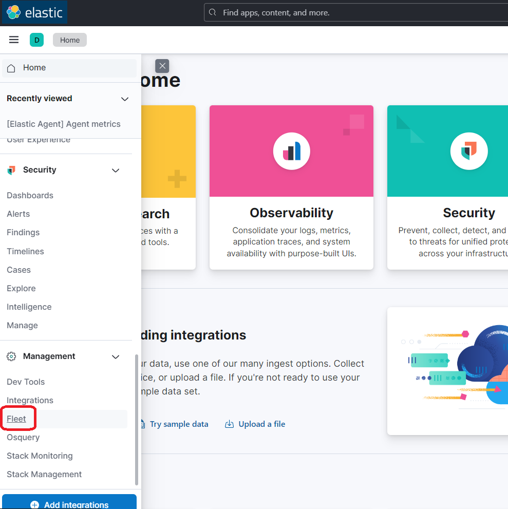</img>
</div>


In the Fleet management screen you should now see the following issues: CPU and Memory are not reading correctly. This is because, by default, our Elastic Agent is attempting to log data to a local Elasticsearch instance, which is not correct for our Docker environment.

<div align="center">
    </img>
</div>

We will need to perform a couple of updates in the Fleet -> Settings UI in order to resolve this. Click on the 'Settings' tab and then the edit action (*green circle*):
<div align="center">
    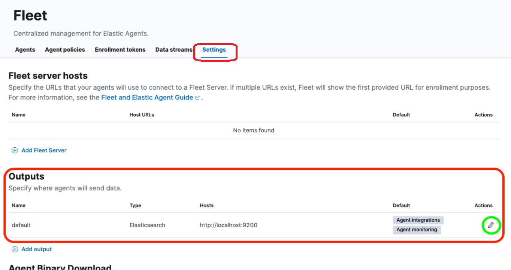</img>
</div>

This should display the following. Notice the red circles.
<div align="center">
    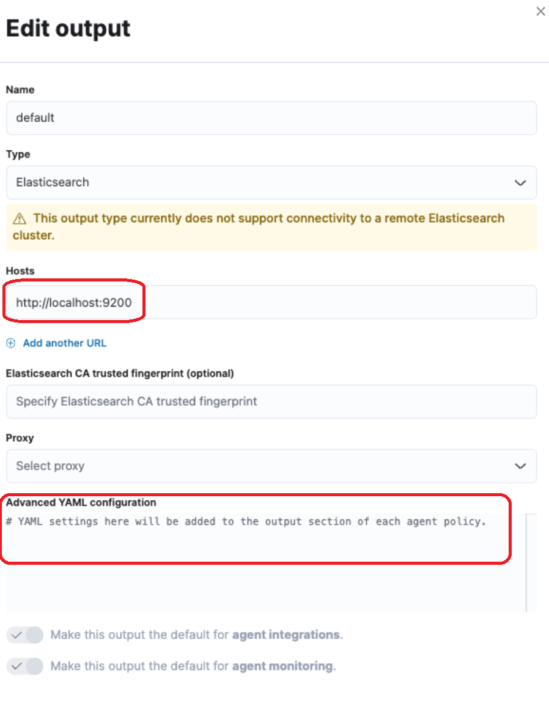</img>
</div>

We now need to change two values:
1. **Hosts**: 
    - Change the value http://elasticsearch:9200 to https://es01:9200         

1. **Advanced YAML configuration**: 
    - We'll need to enter the CA certificate from the cluster, as explained in the next section.

### How to get the CA certificate from the cluster?

Run the following command to pull the CA certificate from the cluster:

```bash
docker cp es-cluster-es01-1:/usr/share/elasticsearch/config/certs/ca/ca.crt /tmp/.
```

>*Note: This command will be different based on either the directory you’re running the docker-compose.yml file from or the COMPOSE_PROJECT_NAME variable that is specified in the .env file.*

Next, we will need to get the fingerprint of the certificate. For this, we can use an OpenSSL command:

```bash
openssl x509 -fingerprint -sha256 -noout -in /tmp/ca.crt | awk -F"=" {' print $2 '} | sed s/://g
```

This will produce a value similar to: 

```
C8EEE11A0713CF5E3E49979A548F1D133DE0ED4A9263DA43AE039A883F94A726
``````

Finally, we need to get the whole cert into a yml format. We can do this with a `cat` command or just by opening the cert in a text editor:

```bash
cat /tmp/ca.crt        
```
<div align="center">
    </img>
</div>

### The correct settings

The final settings should look like this (*ignore the fingerprint*):

<div align="center">
    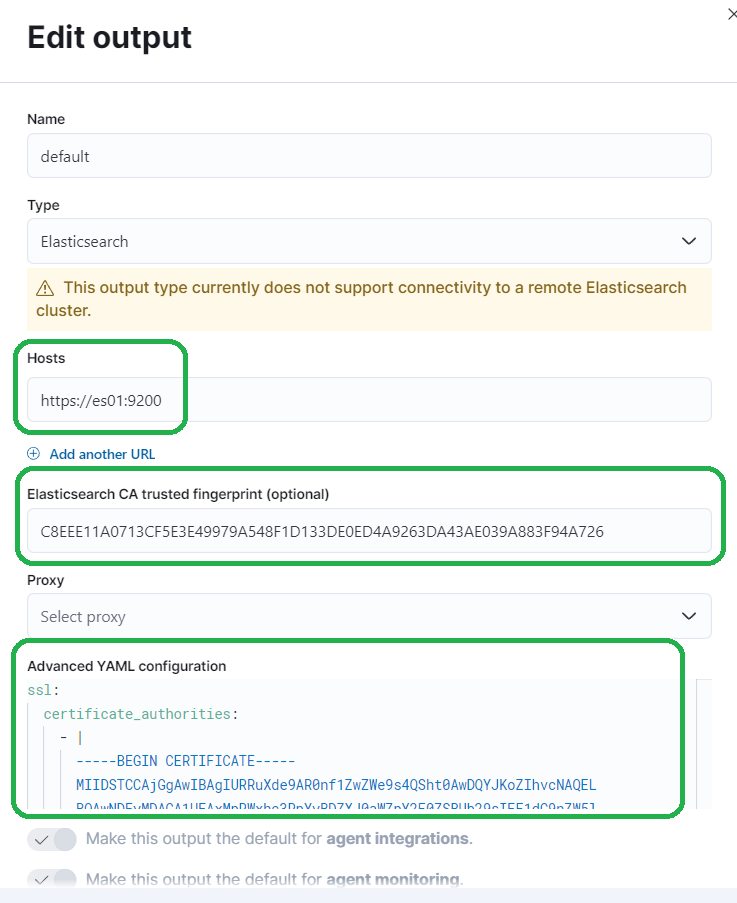</img>
</div>

Don't forget to click “Save and Apply Settings” -> “Save and Deploy.”

<div align="center">
    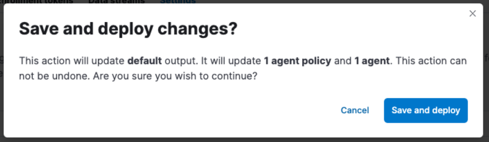</img>
</div>

Your agent should now be running and reporting data to Elasticsearch correctly.

<div align="center">
    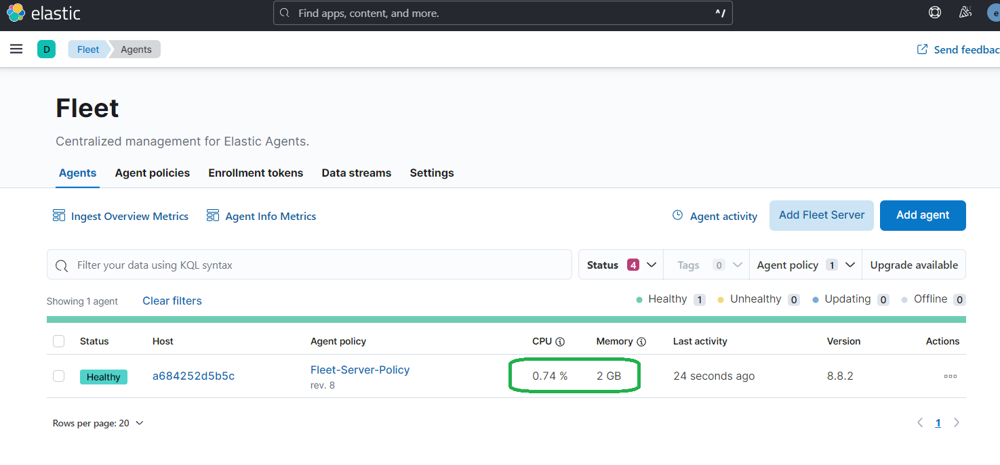</img>  
</div>

And dashboards should work properly:

<div align="center">
    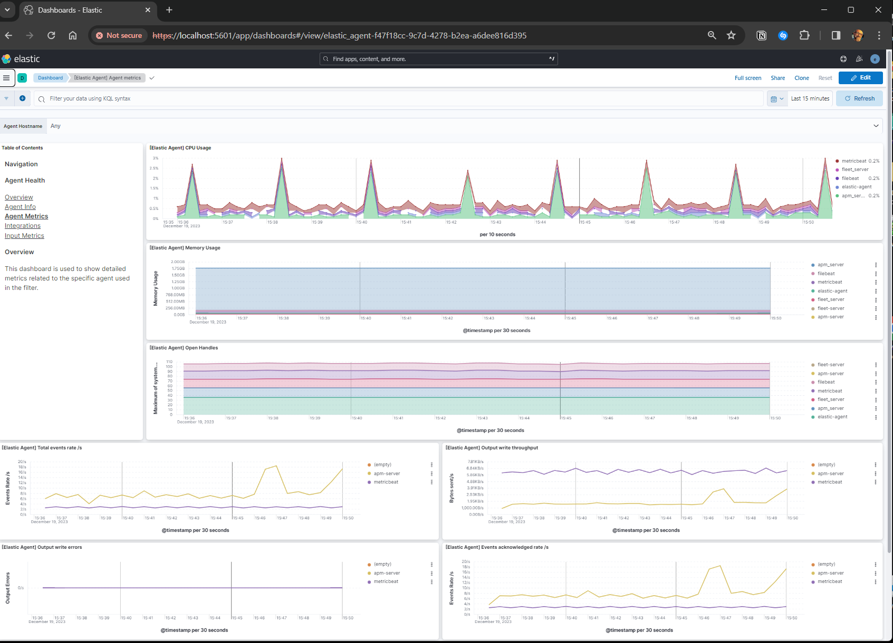</img>
</div> 

## Final considerations

- These instructions have been tested on Windows, using WSL2 and Docker Desktop.

## Resources

1. [Getting started with the Elastic Stack and Docker Compose: Part 1](https://www.elastic.co/blog/getting-started-with-the-elastic-stack-and-docker-compose)
          1. The Githun repo for this article can be found [here](https://github.com/elkninja/elastic-stack-docker-part-one)

2. [Getting started with the Elastic Stack and Docker Compose: Part 2](https://www.elastic.co/blog/getting-started-with-the-elastic-stack-and-docker-compose-part-2)
    1. The Github repo for this article can be found [here](https://github.com/elkninja/elastic-stack-docker-part-two)

1. [Install Elasticsearch with Docker](https://www.elastic.co/guide/en/elasticsearch/reference/current/docker.html)

1. [Install Kibana with Docker](https://www.elastic.co/guide/en/kibana/current/docker.html)